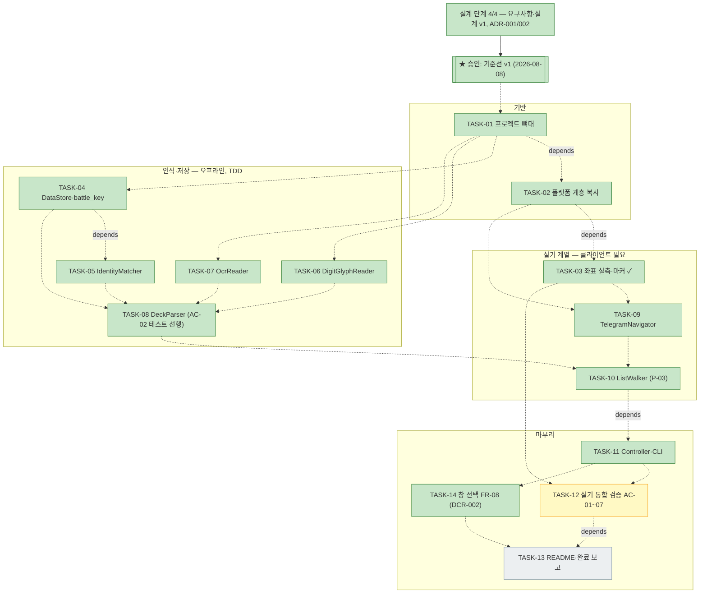

# PLAN-20260808-telegram-deck-extract: deckscan 구현 계획

> 문서 유형: `plan`
> 작업 ID: `20260808-telegram-deck-extract`
> 상태: `in-progress` (2026-08-08 사용자 구현 착수 승인)
> 기준선: `v1` (2026-08-08 승인)
> 작성일: 2026-08-08
> 최종 갱신: 2026-08-09
> 관련 문서: [REQ: 요구사항 v1](./requirements.md), [DESIGN: 설계 v1](./design.md), [ADR-001](./decisions/ADR-001-storage-format.md), [ADR-002](./decisions/ADR-002-recognition-strategy.md)

## 요약

- 목적: 승인된 기준선 v1을 작업 단위로 번역한 구현 계획.
- 현재 결론 또는 상태: **TASK-01~11·14 완료**(기준선 v3 = DCR-002, 오프라인 테스트 57건 성공). 실기 scan 동작 실증(전체 순회·저장·멱등). TASK-12 진행 중 — cmd_0018 분석으로 결함 재분류(B~E: OCR 렌더 변형 오독 중복, 무효 확대 렌더, 정지 화면 오판, 경계 가드) 후 오프라인 수정 완료. 남은 것: 결함 A(묶음 행 펼침 클릭) 실측과 AC-01~07 실기 검증. 인장 3종·글리프(6·7 제외+변형 4종) 수확 완료.
- 다음 행동: [work-log 재개 지점](./work-log.md#재개-지점) — 관리자 실행기 재기동 → 결함 A 실측 → 연속 2회 scan으로 AC-01~07 검증 기록 → TASK-13.

## 문서 연결

| 방향 | 관계 | 대상 문서 | 대상 항목 | 비고 |
|---|---|---|---|---|
| input | baseline | [REQ-20260808-telegram-deck-extract: 요구사항](./requirements.md) | FR-01~07, NFR-01~04, AC-01~06 | 승인 기준선 v1 |
| input | baseline | [DESIGN-20260808-telegram-deck-extract: 설계](./design.md) | DES-01~10 | 승인 기준선 v1 |
| input | decision | [ADR-001: 저장 형식](./decisions/ADR-001-storage-format.md) | ADR-001 | TASK-04 근거 |
| input | decision | [ADR-002: 인식 전략](./decisions/ADR-002-recognition-strategy.md) | ADR-002 | TASK-05~08 근거 |
| input | related | [PF-sgz-statiz: 포트폴리오](../PF-sgz-statiz/portfolio.md) | 작업 목록 | 이 작업이 등재된 포트폴리오(2026-08-09 범위 승인) |

## 기준선

- 관련 요구사항: [요구사항 v5](./requirements.md) 전체 (2026-08-09, DCR-004)
- 관련 설계: [설계 v5](./design.md) 전체 (2026-08-09, DCR-004)
- 관련 ADR·DCR: [ADR-001](./decisions/ADR-001-storage-format.md), [ADR-002](./decisions/ADR-002-recognition-strategy.md), [DCR-001](./changes/DCR-001-list-traversal.md)(순회 전략·측면 매핑·A-02), [DCR-002](./changes/DCR-002-client-selection.md)(FR-08·AC-07 창 선택 → TASK-14), [DCR-003](./changes/DCR-003-battle-key.md)(battle_key 결정적 재료 한정·generals CSV), [DCR-004](./changes/DCR-004-full-deck-only.md)(완전 덱만 저장 — A-03 v2, 모두 2026-08-09 승인)

## 작업 정의

- 목표: 설계 v1의 `deckscan` CLI를 동작·검증 완료 상태로 구현
- 범위: [요구사항 §범위 포함](./requirements.md#범위) 항목 전체
- 범위 밖: [요구사항 §범위 제외](./requirements.md#범위) 항목. git 저장소 초기화·커밋은 사용자 요청 시 별도 수행
- 가정: A-01~A-07(요구사항·설계). TASK-03 실측에서 A-06(참고 이미지 = 실기 배치) 확인
- 위험: RISK-01~06 — 대응은 [설계 §위험](./design.md#위험)

## 계획 트리

<!-- generated — wf-tree 렌더링 생성물. 수정은 아래 작업 목록에서 하고 트리를 재생성한다. -->

모든 TASK는 작업 루트 직속이다(`상위: 없음`). 간선은 전부 `depends:`(순서 제약)다. `[실기]` = 게임 클라이언트 필요(2026-08-08 사용자 확인: 클라이언트 가동 중), `[TDD]` = 실패하는 선행 테스트로 시작(테스트 선행은 각 TASK의 검증 방법에 명시하며 별도 자식 노드로 분해하지 않는다).

```text
[작업] 20260808-telegram-deck-extract — deckscan (기준선 v3) .... in-progress (구현 12/14, 검증 진행 중)
├─ [✓] 설계 단계 (4/4) — 요구사항 v1 · 설계 v1 · ADR-001/002
│   └─ [✓★] 승인: 기준선 v1 (2026-08-08)
├─ [✓] 구현: TASK-01 프로젝트 뼈대
├─ [✓] 구현: TASK-02 플랫폼 계층 복사          depends: 01
├─ [✓] 구현: TASK-03 좌표 실측·마커 [실기]     depends: 02   (패 인장·행 클릭 지대 잔여, ⚠ A-02 편차 → 10에서 DCR 판정)
├─ [✓] 구현: TASK-04 DataStore·battle_key [TDD] depends: 01
├─ [✓] 구현: TASK-05 IdentityMatcher [TDD]     depends: 01, 04
├─ [✓] 구현: TASK-06 DigitGlyphReader [TDD]    depends: 01   (글리프 1·2·3·6·7·8 실기 수확 잔여)
├─ [✓] 구현: TASK-07 OcrReader [TDD]           depends: 01   (무·패 인장 실기 수확 잔여)
├─ [✓] 구현: TASK-08 DeckParser [TDD·AC-02 선행] depends: 04, 05, 06, 07   (패널 상수·임계는 TASK-12 재보정)
├─ [✓] 구현: TASK-09 TelegramNavigator [실기]  depends: 02, 03
├─ [✓] 구현: TASK-10 ListWalker·P-03 [실기]    depends: 08, 09   (기준선 v2 순회 — 묶음 행 펼침 클릭은 12에서 실측 보정)
├─ [✓] 구현: TASK-11 Controller·CLI [TDD]      depends: 04~10
├─ [▶] 검증: TASK-12 실기 통합 검증 AC-01~07 [실기] depends: 03, 09~11   (오프라인 결함 수정 완료 — 결함 A 실측·AC 판정·검증 기록 남음. AC-07 실기 확인 포함)
├─ [✓] 구현: TASK-14 클라이언트 창 선택 FR-08 [TDD] depends: 11   (DCR-002 — 대화형 선택 실기는 AC-07로 12에 편입)
└─ [ ] 문서화: TASK-13 README·완료 보고        depends: 12, 14
```



## 작업 목록

의존 관계: TASK-01 → 02 → {04, 05, 06, 07} → 08(오프라인 계열), TASK-03(실기) → 09 → 10 → 11 → 12 → 13. TASK-05~08은 img/ 픽스처만으로 진행 가능하고, TASK-03의 실측 좌표는 08·09·10의 상수 확정에만 필요하다.

### TASK-01: 프로젝트 뼈대

- 상태: completed (2026-08-08 — `pip install -e .` + 스모크 테스트 성공)
- 상위: 없음
- 목표: `pyproject.toml`(Python ≥3.12, pillow/numpy/opencv-python/windows-capture/winocr), `src/deckscan/` 패키지 골격, venv, `output/` 제외 규칙
- 관련 요구사항과 설계: [설계 §시스템 경계와 구조](./design.md#시스템-경계와-구조)
- 변경 대상: `pyproject.toml`, `src/deckscan/__init__.py`, `.gitignore`
- 검증 방법: `pip install -e .` 후 `python -c "import deckscan"` 성공. 테스트 체계(unittest) 뼈대 1건 실행
- 완료 조건: 위 검증 성공

### TASK-02: 플랫폼 계층 복사 (DES-01)

- 상태: completed (2026-08-08 — 5개 파일 무수정 복사+출처 주석, probe로 창 탐색·캡처 실기 확인)
- 상위: 없음
- 목표: map_search `win/` 4개 모듈 + `watchdog.py`를 출처 주석과 함께 복사, `deckscan.win`으로 임포트 정리
- 변경 대상: `src/deckscan/win/*.py`, `src/deckscan/watchdog.py`
- 의존성: TASK-01
- 검증 방법: TDD 불가(창·캡처 등 환경 의존 — 사유 기록). 임포트 스모크 테스트 + TASK-03에서 실기 확인
- 완료 조건: 임포트 성공, 원본 대비 변경점이 임포트 경로·출처 주석뿐

### TASK-03: P-02 좌표 실측 + ui_telegram 상수 + UI 마커 템플릿 (DES-02)

- 상태: completed (2026-08-09 — 관리자 실행기 경유 실측 완료: 클릭 좌표 4종 2회 검증, 마커 5종 수확+교차 NCC 행렬(임계 0.8), 인장 상자 재보정+무 인장 수확, LIST_REGION·SCROLL_POINT. A-06 성립 확인. [work-log](./work-log.md#2026-08-09--task-03-좌표-실측마커인장-실기-관리자-실행기-경유). 잔여: 패 인장(TASK-12), 행 클릭 안전 지대(TASK-10). **주의: A-02 편차 발견 — 미열람 행 전체 펼침·좌우 역할 반전, TASK-10 착수 시 DCR 판정**)
- 상위: 없음
- 목표: probe 도구(스냅샷·마커 점수)를 먼저 이식하고, 실기 화면에서 클릭 좌표(더 보기·동맹·전보·교전 탭), 화면 판정 마커 4종, 목록 영역, 펼친 패널 상대 크롭을 실측해 `ui_telegram.py`와 `assets/templates/ui/` + 자산 대장을 확정
- 관련 요구사항과 설계: FR-01, [설계 §컴포넌트 DES-02](./design.md#컴포넌트와-책임), 가정 A-06·A-07
- 변경 대상: `src/deckscan/nav/ui_telegram.py`, `src/deckscan/cli.py`(probe), `assets/templates/ui/`, `assets/templates/README.md`
- 의존성: TASK-02. **선행 조건: 게임 클라이언트 실행·로그인(사용자 협조)**
- 위험: 실측 결과가 참고 이미지와 다르면 상수만 재측정(A-06 불일치 시 설계 영향 없음 확인 후 진행)
- 검증 방법: 각 화면 마커 NCC 점수가 해당 화면에서만 임계(초안 0.7) 이상임을 실측 기록
- 완료 조건: 상수·템플릿·대장 등록, 마커 판별 실측 증거

### TASK-04: DataStore + battle_key (DES-09, ADR-001)

- 상태: completed (2026-08-08 — TDD Red→Green, 테스트 8건 성공)
- 상위: 없음
- 목표: [설계 §SQLite 스키마](./design.md#데이터와-인터페이스) 구현, `INSERT OR REPLACE` 멱등, battle_key 생성
- 의존성: TASK-01
- 검증 방법(TDD 선행 테스트): ① 스키마 생성·upsert 멱등(같은 레코드 2회 저장 → 1건) ② battle_key 재현성(동일 입력 → 동일 키) ③ AC-05 집계 질의 ④ 대체 키(파싱 실패 시) — 실패 테스트 먼저 작성
- 완료 조건: 테스트 성공(AC-03 오프라인 부분, AC-05)

### TASK-05: IdentityMatcher (DES-06, ADR-002)

- 상태: completed (2026-08-08 — 테스트 4건 성공: 교차 스크린샷 동일 유저 매칭·상이 유저 구분 실증)
- 상위: 없음
- 목표: 네임스페이스별 템플릿 NCC 매칭, 신규 ID 발행 + pending 등록, 복수 템플릿 허용
- 의존성: TASK-01, TASK-04(identities 테이블)
- 검증 방법(TDD): img/ 크롭 픽스처로 ① 미등록 → 신규 pending ② 동일 크롭 재입력 → 동일 ID ③ 다른 유저 크롭 → 다른 ID(임계 미달) — AC-06 부분
- 완료 조건: 테스트 성공, 임계값 상수화(TASK-12에서 실측 보정)

### TASK-06: DigitGlyphReader 이식 + 레벨 글리프 (DES-07)

- 상태: completed (2026-08-09 — 픽스처 18건 정확 판독. 발견: 레벨 숫자는 금색이 아니라 **흰색**이라 원본 크림 마스크 그대로 유효. 잔여: 글리프 1·2·3·6·7·8 미수확 — 실기 등장 시 증거 수확, TASK-12에 위임)
- 상위: 없음
- 목표: map_search DigitReader 이식, 이름 바 레벨 숫자(금색 폰트) 글리프 수확·등록
- 의존성: TASK-01
- 검증 방법(TDD): img/4~6 레벨 픽스처(50/49 포함 18건) 판독 테스트
- 완료 조건: 픽스처 18건 정확 판독

### TASK-07: OcrReader (DES-08)

- 상태: completed (2026-08-09 — 병력 18/18, 일시 3/3, 승 인장 3/3. 이진화에 잡음 성분 제거+여백 패딩 필요함을 실측 반영. 잔여: 무·패 인장 템플릿 미수확 — 실기 위임)
- 상위: 없음
- 목표: winocr 어댑터 — 병력 수·전투 일시·결과 판독(P-01 검증 전처리 재현), 라벨 제안
- 의존성: TASK-01
- 검증 방법(TDD): img/4~6 병력 18건·일시 3건 판독 테스트. 결과(승) 판정은 인장 템플릿 매칭 포함
- 완료 조건: 픽스처 정확 판독, 판독 실패 시 None 반환 계약

### TASK-08: DeckParser 통합 (DES-05)

- 상태: completed (2026-08-09 — TDD Red→Green, AC-02 인수 테스트 포함 5건 성공, 전체 22건. 유저·동맹 스트립 NCC 임계 0.80 실측 채택 — [work-log](./work-log.md#2026-08-09--task-08-deckparser-tdd))
- 상위: 없음
- 목표: 펼친 패널 크롭 → `BattleRecord`, `ok|partial|failed` 판정, 실패 크롭 증거 저장
- 의존성: TASK-04~07 (+패널 상대 좌표는 img/ 실측 초안 → TASK-12에서 확정)
- 검증 방법(TDD): **AC-02 인수 테스트를 실패 상태로 먼저 작성**(img/4.png → 기대 레코드), img/5·6 확장, 훼손 크롭 주입 시 partial 계속(AC-04 부분, NFR-01)
- 완료 조건: AC-02 픽스처 테스트 성공

### TASK-09: TelegramNavigator (DES-03)

- 상태: completed (2026-08-09 — TDD 4건 + 실기 1회 내비게이션 성공(재시도 로직 실전 작동 포함), [work-log](./work-log.md#2026-08-09--task-09-telegramnavigator-tdd--실기). 실기 결함 2건 수정: 전환 연출 중 클릭 무시 → wait_stable, 목록 갱신 중 무반응 → 1회 재시도)
- 상위: 없음
- 목표: wait_stable·마커 NCC·클릭 전 재검증·타임아웃 이식, 메인→교전 탭 내비게이션(FR-01, NFR-02)
- 의존성: TASK-02, TASK-03
- 검증 방법: 판정 유틸은 픽스처 단위 테스트(마커 점수), 내비게이션 자체는 자동 테스트 불가(실기 — 사유 기록) → TASK-12 AC-01
- 완료 조건: 유틸 테스트 성공, 실기 1회 내비게이션 성공 로그

### TASK-10: ListWalker (DES-04)

- 상태: completed (2026-08-09 — 기준선 v2 순회 구현: 행 재탐지·행별 펼침 판정·측면 라벨 판정·스크롤·종착·이중 프레임 확증·멱등. 오프라인 walk 테스트 + 실기 전체 순회 실증, [work-log](./work-log.md#2026-08-09--task-10-완결부task-11-scan-연결-tdd--실기-기준선-v2). 잔여 실측 2건(묶음 행 펼침 클릭 지대·목록 경계 가드)은 TASK-12에서 보정)
- 상위: 없음
- 목표: 행 헤더 재탐지, **행별 펼침 상태 판정 후 접힌 행만 안전 지대 클릭**(DES-04 v2), 배너 스킵, 휠 스크롤·종착 판정(P-03 확인 포함). DeckParser에 측면 라벨 판정 추가(DES-05 v2)
- 의존성: TASK-08, TASK-09
- 검증 방법: 행 헤더 탐지는 img/3~6 픽스처 단위 테스트(펼침 위치 3종·배너 미탐지), 순회는 실기(TASK-12). P-03 실패 시 순회 전략 변경은 DCR로 반환
- 완료 조건: 픽스처 테스트 성공, 실기 순회 1회 성공

### TASK-11: Controller + CLI (DES-10)

- 상태: completed (2026-08-09 — export·label·요약 + `run_scan` 오케스트레이션·CLI scan(해상도 검증·종료 코드 0/1/2) TDD 완료, 실기 scan exit 0 실증, [work-log](./work-log.md#2026-08-09--task-10-완결부task-11-scan-연결-tdd--실기-기준선-v2))
- 상위: 없음
- 목표: `scan|export|label|probe` 명령, run 요약(FR-06), 실패 흐름 표( [설계](./design.md#정상실패복구-흐름) ) 구현, CSV 내보내기
- 의존성: TASK-04~10
- 검증 방법(TDD): export CSV 계약 테스트, label 흐름 테스트(pending → confirmed 반영, AC-06 완결), 요약 집계 테스트. scan 전체는 실기
- 완료 조건: 테스트 성공, `--help` 포함 CLI 동작

### TASK-12: 실기 통합 검증 + 캘리브레이션

- 상태: in-progress (2026-08-09 — cmd_0018 분석·결함 B~E 오프라인 수정 완료(테스트 51건), [work-log](./work-log.md#2026-08-09--task-12-cmd_0018-분석-실기-결함-재분류be와-오프라인-수정-tdd). 잔여: 결함 A 실측·호버 확대 확증·AC-01~06 판정)
- 상위: 없음
- 목표: 실기에서 AC-01(내비게이션), AC-03(연속 2회 실행 멱등), AC-04(실패 요약) 검증, NCC 임계·패널 좌표 보정, verification.md 작성
- 의존성: TASK-03, TASK-09~11. **선행 조건: 게임 클라이언트 실행·로그인**
- 검증 방법: [설계 §검증 전략](./design.md#검증-전략) 표대로 실행, 로그·DB 카운트·증거 캡처 기록
- 완료 조건: AC-01~06 결과가 verification.md에 증거와 함께 기록

### TASK-14: 클라이언트 창 동적 탐지·선택 (FR-08, DCR-002)

- 상태: completed (2026-08-09 — TDD 6건 + 실기: 비대화형 다중 거부·`--hwnd` 경로 실증, Windows NUL isatty() 함정 수정(EOF=중단). 단일 후보 스모크는 상시 2클라이언트 환경이라 불가(단위로 갈음), 대화형 선택 실기는 AC-07로 TASK-12에 편입 — [work-log](./work-log.md#2026-08-09--dcr-002-승인기준선-v3-task-14-클라이언트-창-선택-tdd--부분-실기))
- 상위: 없음
- 목표: `scan`·`probe` 구동 시 창 후보 동적 탐지 — 다중이면 대화형 선택(번호 → 전면 표시 → y/n 확인), 단일이면 자동 진행, `--hwnd` 생략 경로, 비대화형 다중은 목록과 함께 거부(종료 1). `choose_window`는 입력 콜백 주입으로 단위 테스트 가능하게.
- 관련 요구사항과 설계: FR-08, [DES-10 v3](./design.md#컴포넌트와-책임), [DCR-002](./changes/DCR-002-client-selection.md)
- 변경 대상: `src/deckscan/controller.py`(choose_window), `src/deckscan/cli.py`(probe·scan 창 확정 경로 통합)
- 의존성: TASK-11
- 검증 방법(TDD): 선행 테스트 — 단일 후보 자동 반환, 다중 선택→전면 확인→확정, 확인 거부 시 재선택, `q` 중단, 잘못된 입력 재프롬프트. AC-07 실기 확인은 TASK-12에 편입(두 클라이언트 동시 가동 시)
- 완료 조건: 단위 테스트 성공, CLI 동작(단일 후보 실기 스모크)

### TASK-13: 문서 정리 + 완료 보고

- 상태: pending
- 상위: 없음
- 목표: README(설치·사용법·label 운영 절차·창 선택 절차), 자산 대장 최종화, completion 기록, 추적성 갱신
- 의존성: TASK-12, TASK-14
- 완료 조건: [wf-implement 완료 조건](file:///C:/Users/hippo/.claude/skills/wf-implement/SKILL.md) 충족, 문서 자체 검토 통과

## 검증 계획

- 단위·인수 테스트: unittest, `tests/` + `tests/fixtures/`(img/ 크롭 파생). TDD — 각 TASK의 선행 테스트를 Red로 시작.
- 실기 검증: TASK-12에 집약. 결과는 verification.md의 VER-01~(AC별)로 기록.
- 자동화 불가 항목: AC-01(화면 자동 판정은 하지만 최종 확인은 실기 로그·캡처 증거), 내비게이션·순회 — 사유와 함께 후행 검증.

## 마이그레이션과 롤백

- 신규 프로젝트 — 마이그레이션 없음. `meta.schema_version=1` 기록.
- 롤백: `output/` 삭제로 데이터 초기화. 코드 변경은 로컬 파일 삭제로 복원(git 미사용 상태 — 초기화 여부는 사용자 결정 대기).

## 인계

- 다음 단계 또는 워크플로우: 구현 실행(이 계획의 TASK-01부터)
- 시작 조건: 사용자 구현 착수 지시. TASK-03·12의 클라이언트 실행 조건은 충족(2026-08-08 사용자 확인, 상시 사용 허가)
- 입력 문서와 기준선: [요구사항 v1](./requirements.md), [설계 v1](./design.md), ADR-001·002
- 완료된 항목: 계획 수립
- 미완료 항목: TASK-01~13 전체
- 차단 요인: 없음
- 다음 행동: TASK-01 착수 → work-log.md 생성
